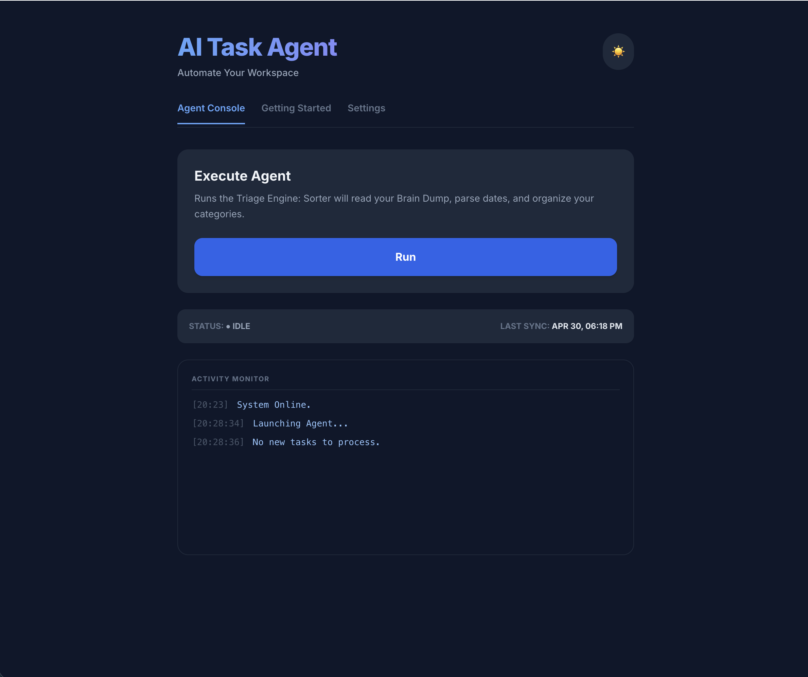
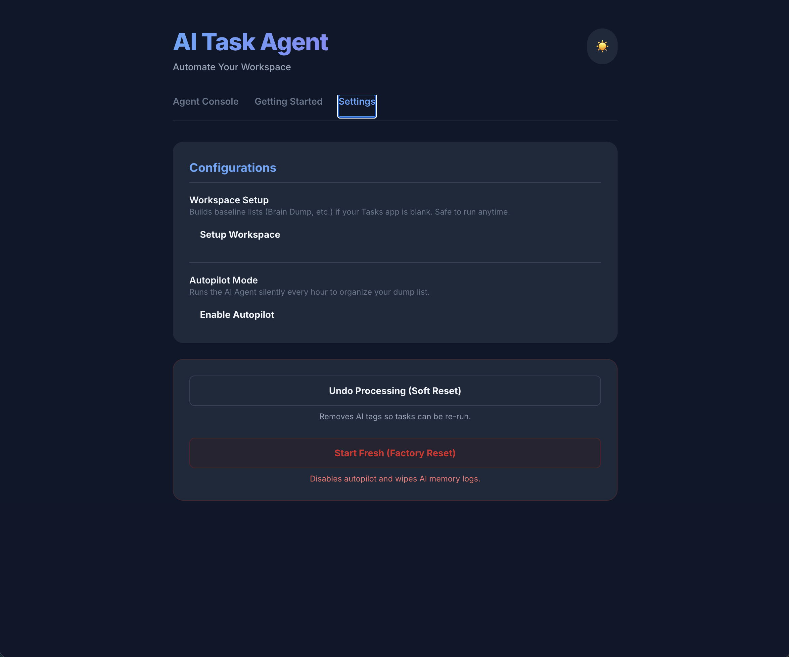

# AI Task Agent 🧠⚡️

An autonomous, LLM-powered task triage engine built natively for Google Workspace. This agent transforms a messy "Brain Dump" into an organized, calendar-synced workspace.

## 📸 Screenshots
### Agent Console

### User Guide

### Configurations

## 🛠️ Tech Stack
- **Backend**: Google Apps Script
- **Frontend**: React.js & Tailwind CSS
- **AI Model**: Gemini 2.5 Flash API

## 🚀 Installation Guide
1. Create a new project at [script.google.com](https://script.google.com).
2. Enable the **Google Tasks API** in the Services tab.
3. Add your `GEMINI_API_KEY` to the **Script Properties** in Project Settings.
4. Deploy as a **Web App**.
